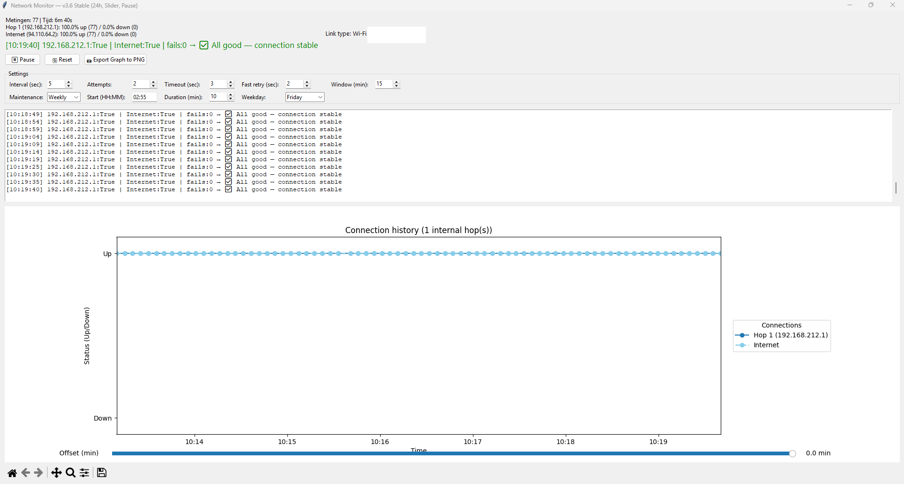

# Network Monitor 🛰️  
Multi-hop Network Connectivity and Latency Visualizer

---

## Overview
**Network Monitor** is a lightweight Python utility that continuously checks the connectivity between your computer, all internal network hops (routers, firewalls, modems), and the public Internet.
It displays real-time results in both a terminal and a graphical interface with dynamic charts (connectivity **and latency**) plus logging.

Originally built for troubleshooting double-NAT and mesh Wi-Fi setups, it works equally well on simple single-router networks.

---

## ✨ Features
- **Automatic hop detection** using PowerShell `Test-NetConnection` (Windows) or `traceroute` (Unix/macOS).
- **Monitors all private IP hops** (e.g., 192.168.x.x, 10.x.x.x, 172.16–31.x.x).
- **First public hop** (e.g., your ISP gateway) is treated as the *Internet*.
- **Real-time graphs**:
  - Each internal hop in a unique color.
  - Internet link shown as a **light blue dashed line** (cloud color).
  - Split view with **status** (up/down) history and **latency** timelines for every hop.
  - Live status updates (Up/Down) every few seconds.
- **Console + GUI logging** with colored status messages.
- **Automatic CSV/TXT logging** of all results.
- **Export graph to PNG** with a “Save As…” dialog.
- Works on **Windows, macOS, and Linux**.

---

## 🧰 Requirements

**Python:** 3.9 or higher  
**Modules:**

```bash
pip install matplotlib
```

**System tools:**
- On Windows: PowerShell must be available (default)
- On Linux/macOS: `traceroute` command must be installed

---

## 🚀 Usage

1. **Clone the repository:**

   ```bash
   git clone https://github.com/SoltechNV/Network-Monitor.git
   cd Network-Monitor
   ```

2. **Run the tool:**

   ```bash
   python network-monitor.py
   ```

3. The GUI will:
   - Detect your connection type (Wi-Fi / LAN)
   - Discover all hops
   - Start live monitoring and graph updates every 5 seconds

4. Use the **📸 Export Graph to PNG** button to save a snapshot of the chart.

---

## ⚙️ Settings Panel
Fine-tune how aggressively the monitor runs via the settings strip directly under the toolbar:

- **Interval (sec)** – Delay between full hop scans. Lower values update the chart faster but run more traceroutes/pings.
- **Attempts** – Number of probes the tool makes per hop before declaring it down.
- **Timeout (sec)** – Maximum wait per attempt before considering that probe a failure.
- **Fast retry (sec)** – Short polling window that activates automatically during an outage so the app can confirm recovery quickly.
- **Window (min)** – Duration of history kept in the graph and slider. Increasing it lets you scroll further back in time.
- **Maintenance** – Choose **Off**, **Daily**, or **Weekly** to mark scheduled maintenance windows:
  - **Start (HH:MM)** defines when the window begins (24-hour format).
  - **Duration (min)** controls how long maintenance mode suppresses outage alerts.
  - **Weekday** becomes available for weekly schedules so you can pick the exact day.

All selections are saved to `network_monitor_settings.json`, so your preferred cadence and maintenance windows load automatically the next time you start the app.

---

## 🖼️ Example Screenshot
Below is a recent capture of the Network Monitor interface in action.



---

## 🗂️ Log Files
- `network_log_YYYY-MM-DD_HH-MM-SS.txt` — human-readable event log
- `network_log_YYYY-MM-DD_HH-MM-SS.csv` — machine-readable data log for spreadsheets (status + latency columns)

Fresh log files are created in the same directory as the script every time the
application starts, and again whenever you press the **🔄 Reset** button. This
keeps each monitoring session neatly separated.

---

## 📊 Live Dashboard

Every run shows a compact dashboard above the chart:

- A bold live status banner with the latest classification (✅/❌/🟠/🔴/⚠️).
- Measurement counters, elapsed time, and the timestamp of the last probe.
- Per-hop progress bars highlighting uptime percentage, plus rolling average and last measured latency in milliseconds.
- A dedicated Internet row so you can instantly compare LAN versus WAN health.

## 🧠 Status Indicators
| Symbol | Meaning |
|---------|----------|
| ✅ | All good — connection stable |
| ❌ | First hop unreachable — local LAN issue |
| 🟠 | Intermediate hop down — router/modem issue |
| 🔴 | Internet down — ISP or DNS problem |
| ⚠️ | Indeterminate state |

---

## 🧩 Example Output (console)
```
[17:42:15] 192.168.1.1:True | 192.168.5.1:True | Internet:True → ✅ All good — connection stable
[17:42:20] 192.168.1.1:True | 192.168.5.1:False | Internet:False → 🟠 Hop 2 (192.168.5.1) down — intermediate router issue
```

---

## 📦 Exported Graph
When you press **📸 Export Graph to PNG**, a “Save As…” dialog lets you choose a filename and folder.  
The file will be saved as a clean graph snapshot with all hop histories.

---

## ⚖️ License
MIT License — feel free to modify, share, and improve this tool.

---

## 👨‍💻 Author
**Ronny Franken**  

---

*Troubleshooting your LAN has never been this visual.*
